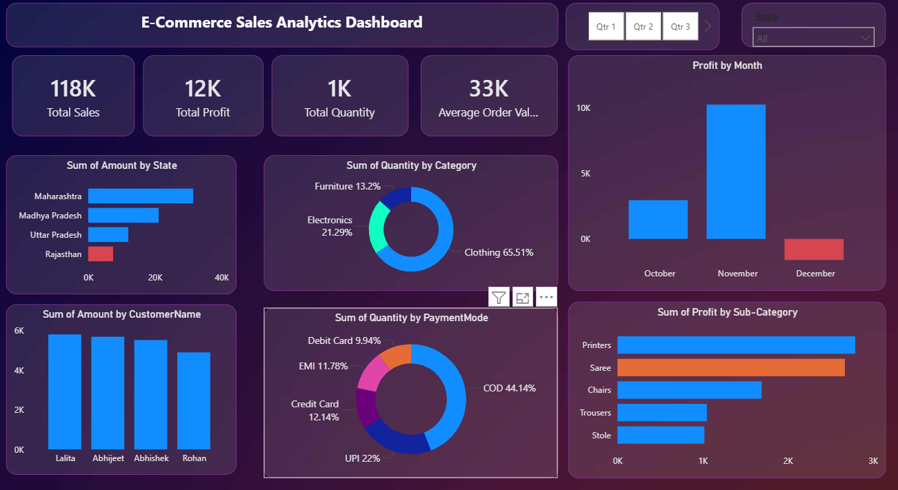

# E-Commerce Sales Analytics Dashboard

## Overview

This project is an interactive Power BI dashboard developed to analyze e-commerce sales performance, profitability, customer behavior, and product category trends. The dashboard provides key business insights through visually appealing and interactive reports.

---

## Dashboard Preview



---

## Key Metrics

- Total Sales: 118K
- Total Profit: 12K
- Total Quantity Sold: 1K
- Average Order Value (AOV): 33K

---

## Features

### Sales Analysis
- State-wise sales performance
- Customer-wise sales analysis
- Quarterly sales filtering

### Profit Analysis
- Monthly profit trends
- Profit by sub-category

### Category Analysis
- Quantity sold by category
- Product category contribution analysis

### Payment Analysis
- Quantity distribution by payment mode
- Customer payment preferences

### Interactive Filters
- Quarter-wise filtering
- State-wise filtering

---

## Dataset

The dashboard uses two datasets:

### Orders.csv
Contains:
- Order ID
- Order Date
- Customer Name
- State
- City

### Details.csv
Contains:
- Order ID
- Amount
- Profit
- Quantity
- Category
- Sub-Category
- Payment Mode

The datasets are connected using the **Order ID** field.

---

## Tools & Technologies

- Power BI
- DAX
- Power Query
- Data Modeling

---

## Dashboard Insights

- Maharashtra generated the highest sales among all states.
- Clothing contributed the largest share of quantity sold.
- COD was the most preferred payment method.
- Printers and Sarees were among the most profitable sub-categories.
- Profit showed significant growth during November.

---

## Project Structure

```text
ecommerce-sales-dashboard-powerbi/
│
├── Ecommerce_Sales_Dashboard.pbix
├── Orders.csv
├── Details.csv
├── dashboard.png
└── README.md
```

---

## How to Use

1. Download the `.pbix` file.
2. Open it in Power BI Desktop.
3. Refresh the data if required.
4. Interact with slicers and visualizations to explore insights.

---

## Skills Demonstrated

- Data Cleaning
- Data Modeling
- DAX Measures
- Data Visualization
- Business Intelligence Reporting
- Dashboard Design
- Interactive Reporting

---

## Author

**Shekar Naidu**

GitHub: https://github.com/Shekar13
